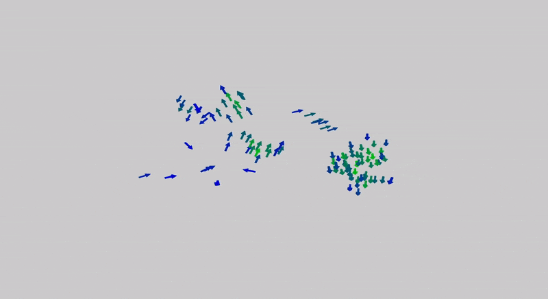

After having spent time working in Unity and being confused by the black box functionality of shaders and materials systems in fully-fledged game engines, I began looking into creating my own 3D graphics and GUI from plain C++.

In high school I had written a VPython demo of a Boids simulation for a precalculus project and although I enjoyed assembling the logic, the graphics library handled pretty much all of the rendering and camera controls. 

Starting from scratch wasn't too hard, especially given the many useful resources on OpenGL these days, and I think my result's performance is much better than the original Python version.