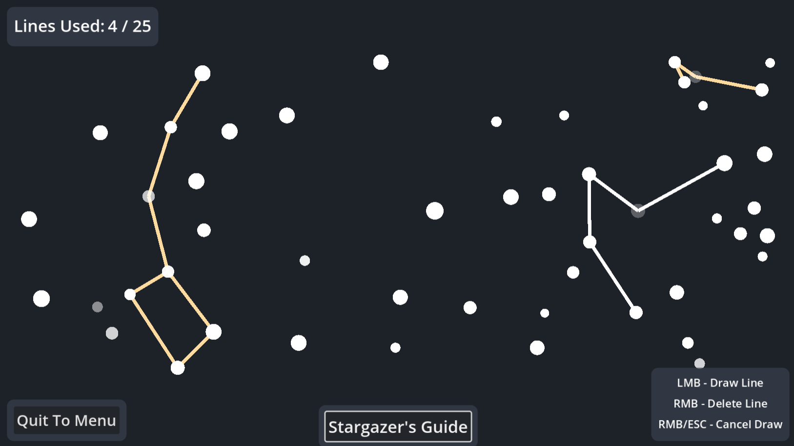

### [Play on Itch.io](https://codelazarus.itch.io/constellation-finder)

Constellation Finder is my first game in the Godot engine, inspired by my fascination with stargazing and the seemingly infinite expanse of patterns in the night sky. In it, the player is tasked with finding a specific set of constellations visible in a randomly-generated night sky. Using their mouse, the player can draw lines between any two stars, but finding the right pattern requires a mix of careful scrutiny and following the Stargazer's Guide.

Initially, I had planned on drawing the night skies from random patches of the night sky on Earth every time, but this seemed like a daunting task halfway through development. Instead, I opted to randomly generate all of the skies according to adjustable parameters, which made it easier to control the difficulty and ensured more fairness than the real sky could guarantee.