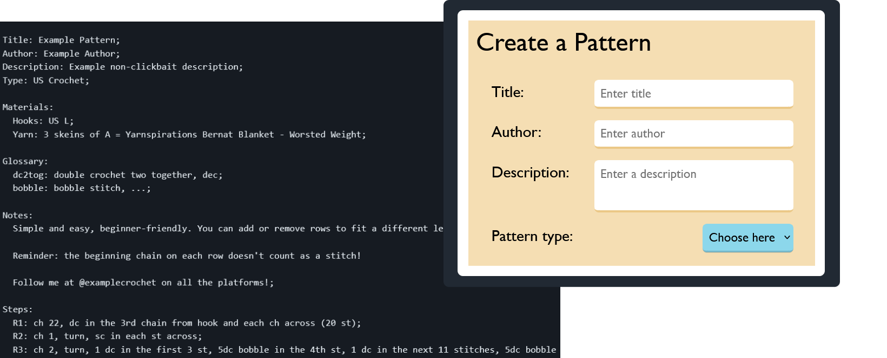

[Link to the website](https://codelazarus14.github.io/crochet-pattern-js/)

Some time around the spring of 2022 I rekindled an old hobby interest in crochet. It seemed like something fun, detail-oriented and easy to get into, and I enjoyed the process as much as the result. As I started to browse sites like [ravelry.com](https://www.ravelry.com/) for more patterns, I noticed that while many of them existed in easy-to-create portable formats, such as a page on the author's blog or a PDF. 

Much of the structure of each pattern varied quite a lot between authors. While sites like Ravelry have a useful variety of filters for finding patterns and favorite authors, the patterns themselves could be cumbersome to navigate when they used specific stitch combinations or unique naming schemes, causing the crocheter to have to flip back and forth between pages frequently to see where new terms had been defined or row combinations were referenced. 

Initially I had the idea to write a custom file format and parser for crochet patterns in a less user-friendly scheme. This would have allowed for patterns composed of mostly plain text instructions to be encoded in a format more useful to people writing software that could display them. However, this would have put more burden on the author to be careful about syntax, not to mention limiting the potential audience to people who crochet and requiring someone (probably me) to have to write a GUI version in the future anyway.

So I took the shortcut of using JSON and the opportunity to learn more Javascript by creating a website to create and manage an offline store of patterns for the user. The website allows users to create patterns, preview and/or output their pattern data, and track their progress through each one in the same place. The website is entirely client-side as it is focused mostly on personal convenience rather than being a public collection.
