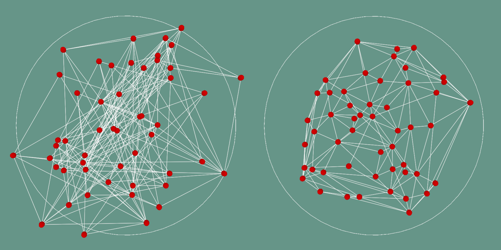

A visualization of thermal fluctuations on a 3D triangulated surface in Unity.

I wrote a blog post about this project after finishing it up in summer 2024, have a look [here](../blog/2024/07/05/physics-detour/).