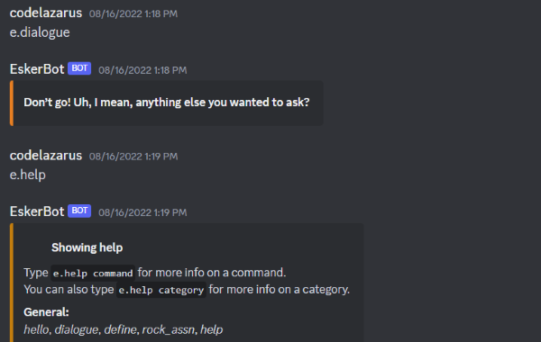
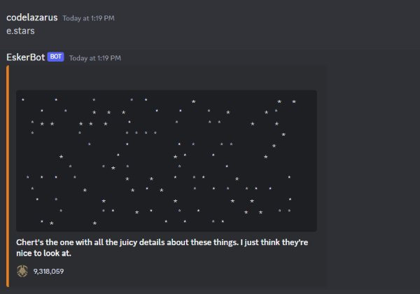

Using Discord.py and Asyncio, I created my first Discord chatbot themed around the game Outer Wilds. The bot includes a variety of features: marshmallow-toasting competitions, querying the Outer Wilds Fan Wiki, playing bits of the OST in voice channels and watching an ASCII-art universe slowly fade away during the end of times.

