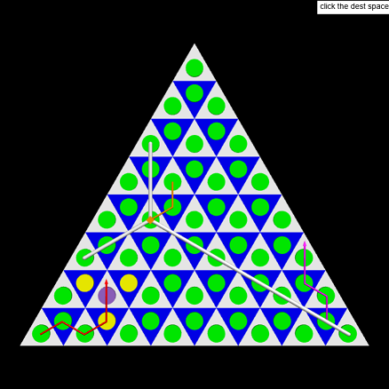

After becoming enamored with the game [Outer Wilds (2019)](https://store.steampowered.com/app/753640/Outer_Wilds/), I spent some time learning a community-made modding framework and created some basic mods to test out my ideas. One of my first inspirations were the board game props found throughout a section of the game that supplemented other relics of leisure. They had caused some speculation about what a game with the given board and pieces would look like, but I hadn't seen any working implementations.

I took it upon myself to start designing the basic mechanics of a chess-like board game on a triangular lattice. The first demo of these was written in Python and it allowed me to experiment with making the board traversible, as well as creating a queen-like central piece that would be able to capture pieces across the board (hopefully the image below conveys the idea well enough!)

Translating this into a mod took a lot of effort, particularly in mapping the 2D VPython space into a 3D game environment with unique assets for the board and pieces. The end result allows the player to opt in to an extended version of the original game's DLC ending, where the player can play a version of the same board game against an AI.

# INSERT MOD SCREENSHOT HERE