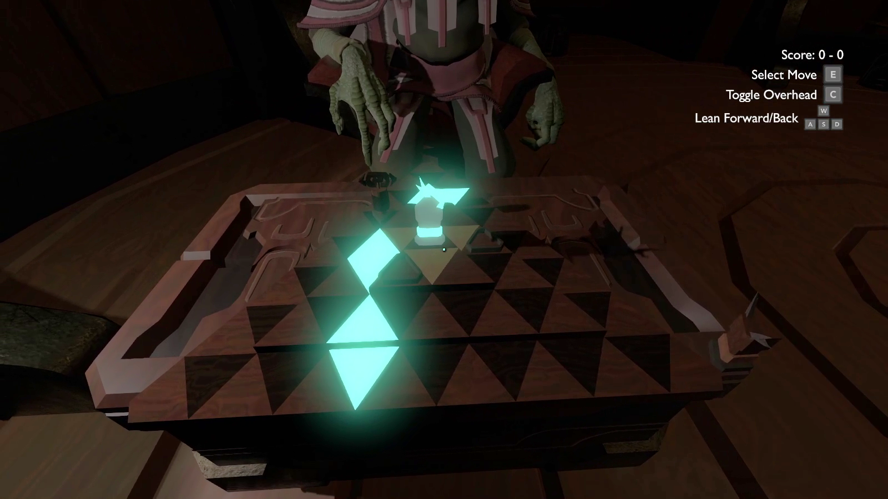
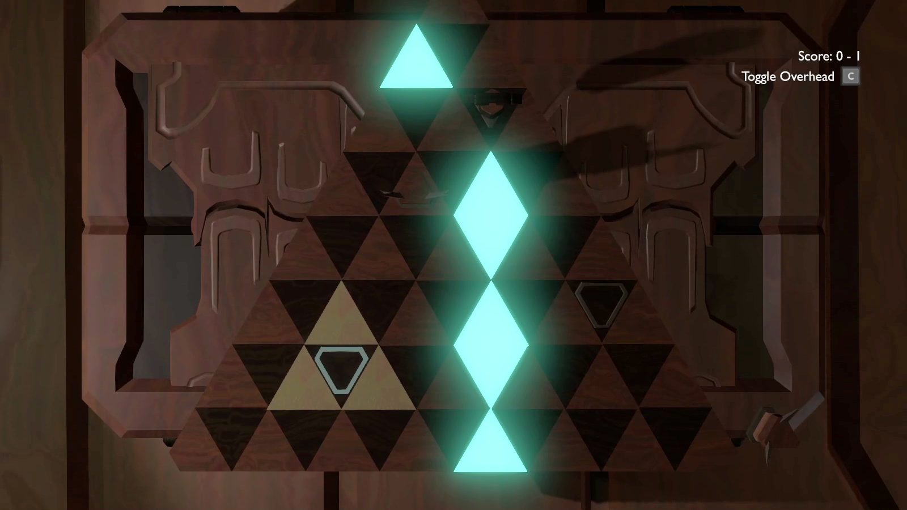

After falling in love with the video game [Outer Wilds](https://www.mobiusdigitalgames.com/outer-wilds.html), I spent some time learning how to create mods for the game, inspired by what others had already created with the OWML framework. After experimenting with smaller edits targeting certain characters and areas of the world, I started looking into something involving the triangular game boards found in the game's DLC. I knew some players had discussed what the game played on them would look like, but there didn't seem to be any working ideas.

I took it upon myself to start designing the basic mechanics of a chess-like triangular board game in Python. This demo allowed me to experiment with making the board traversible on a hexagonal lattice, alongside creating pieces and the rules that governed them, including a queen-like central piece that would be able to capture pieces along lines drawn from the center to the points of the currently-occupied triangle and beyond (as shown by the small orange piece in the image below).

Once I was happy with the design, I started translating the 2D VPython demo into 3D for the mod while using the game's materials, sound and animations. The mod is named after the characters who would have formerly played this board game in a now-derelict spacecraft, sometimes referred to as its inhabitants. It allows the player to opt in to an alternate version of the DLC's ending, where the player can play the board game against another character.

The game rules, and the mod for Outer Wilds, are available on GitHub at the link above.

